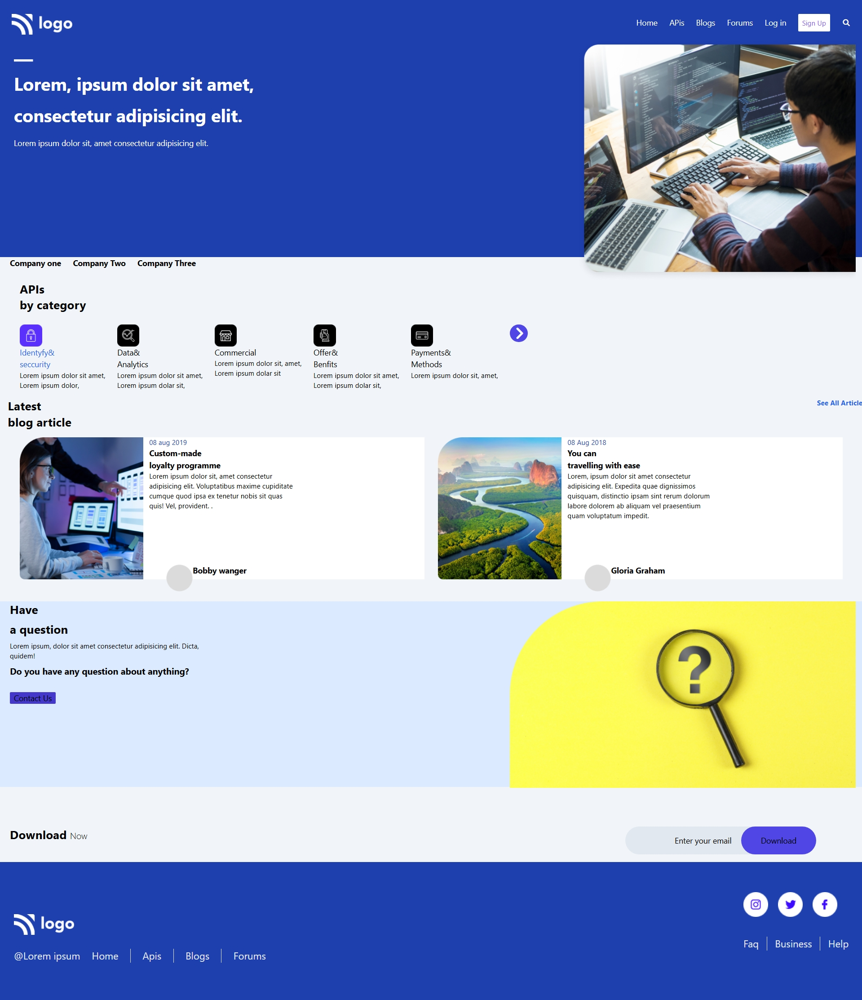

Here’s a clean, professional `README.md` you can use for your project:

---

# 🌐 API Landing Page (Tailwind CSS)

A modern, responsive landing page built using **HTML** and **Tailwind CSS**. This project showcases a clean UI for an API platform with sections like navigation, hero banner, API categories, blog articles, and a footer.

---


[live@](https://gracyamma.github.io/project08_Developer/)





## 🚀 Features


* 📱 Fully responsive design (mobile + desktop)
* 🎨 Styled with Tailwind CSS utility classes
* 🔤 Custom fonts using Google Fonts (Poppins, Orbitron, Roboto)
* 🧭 Navigation bar with menu and search icon
* 🧩 API categories section
* 📰 Blog/article preview section
* 📩 Email subscription input
* 📌 Footer with links and social icons

---

## 🛠️ Tech Stack

* **HTML5**
* **Tailwind CSS (CDN)**
* **Font Awesome (Icons)**
* **Google Fonts**

---

## 📁 Project Structure

```
project-folder/
│
├── index.html
├── README.md
└── 08Developer/
    └── images/
        ├── Logo.png
        ├── Rectangle.png
        ├── Rectangle Copy.png
        ├── Group 97.png
        ├── Group 98.png
        ├── Group 99.png
        ├── Group 100.png
        ├── Group 101.png
        └── ...
```

---

## ⚙️ Setup & Usage

1. Clone the repository:

   ```bash
   git clone https://github.com/your-username/your-repo-name.git
   ```

2. Open the project folder:

   ```bash
   cd your-repo-name
   ```

3. Run the project:

   * Simply open `index.html` in your browser.

---

## 💡 Customization

* Update text content inside HTML
* Replace images in `/images` folder
* Modify Tailwind classes for styling
* Add interactivity using JavaScript if needed

---

## 📸 Preview

> Add a screenshot of your project here
> Example:

```

```

---

## 📌 Future Improvements

* Add mobile menu toggle functionality
* Improve accessibility (ARIA labels, semantic HTML)
* Connect email form to backend service
* Add animations and transitions


